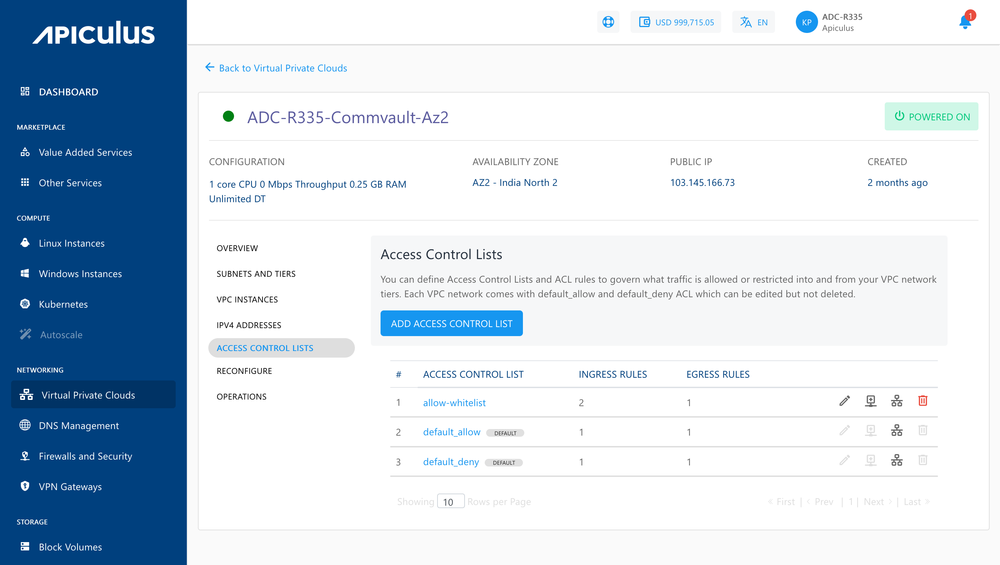
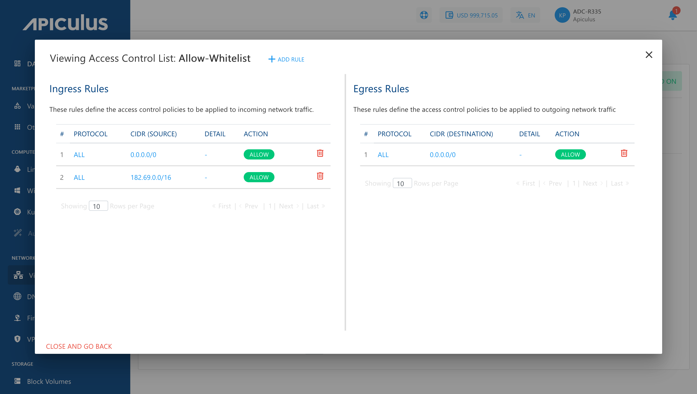

# Managing Access Control on VPC Subnets

Access control policies can be created using Access Control Lists (ACL) and configuring rules within these ACL (called ACL Rules). An ACL can then be applied to any tier within the VPC. These policies govern what traffic is allowed or restricted into and from your VPC network tiers.

:::note
Each VPC comes with **default_allow** and **default_deny** ACL, which can be edited but not deleted.
:::

To access the ACL navigate to **VPC details** and select the  **Access Control Lists** tab. You can perform the following actions on any available ACL:

- Edit the ACL name
- Add an ACL rule
- Assign the ACL to a tier
- Delete the ACL

## Creating Custom ACL and Adding Rules

You can create a custom ACL by clicking the **ADD ACCESS CONTROL LIST** button and assigning a name to the ACL. An ACL is a collection of individual traffic control rules that must be configured after the ACL is created.

Any available ACL (existing or new) can be viewed in detail by clicking its name in the list. This displays a list of rules that govern ingress (incoming) and egress (outgoing) traffic for the subnet. From this section, you can create new rules or delete existing ones.

