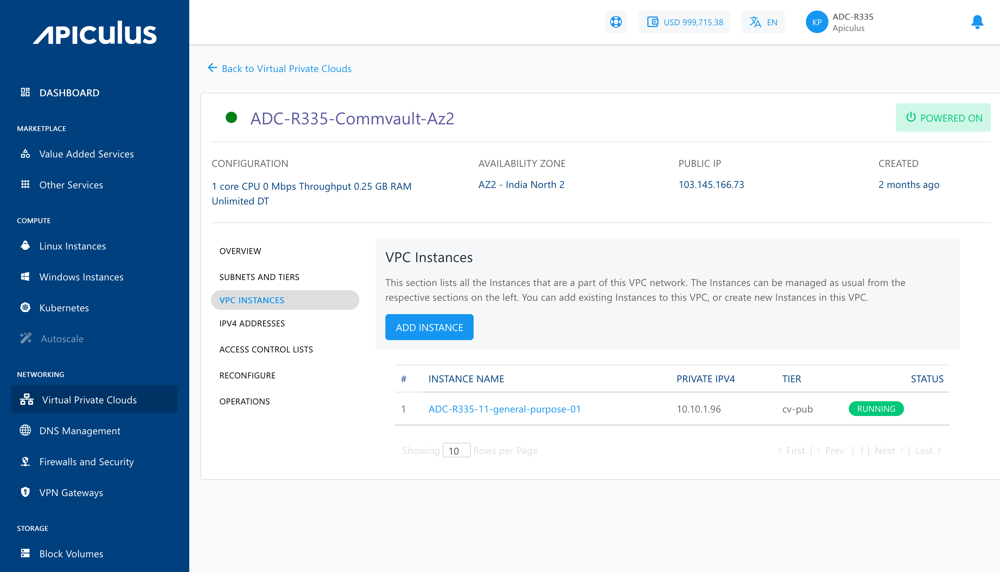
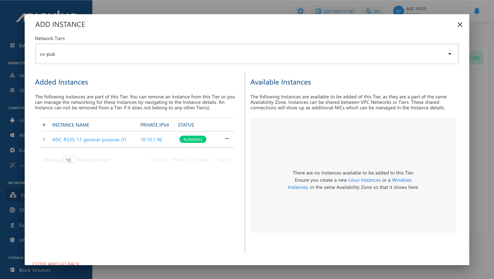

# Managing VPC Instances

## Viewing VPC Instances

Apiculus Cloud Console offers a quick means to view Instances that are part of a VPC network, and to associate or dissociate Instances with VPCs by navigating to VPC details and selecting  **VPC Instances**.

## Adding (or Removing) Instances to VPC

To view all Instances that are available to be added to this VPC, click the **ADD INSTANCE** button. Since VPC allows adding multiple NICs to instances, instances can be shared between VPC networks (and across tiers within the same VPC), as long as the VPC networks are within the same Availability Zone.

:::note
An Instance created in any VPC/advanced Availability Zone must be attached to at least one subnet.
:::

