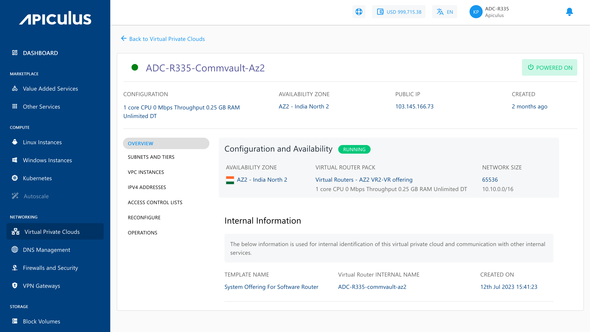

# Overview

To view a list of sections and the various operations or actions you can perform by going inside the particular section, click on the VPC name. Below the VPC name is an informational view where you can find the details below.

- Configuration
- Availability Zone
- Public IP
- Created

Along with the summary, the following information is readily available under the **Overview** tab:

- **Configuration and Availability**-
    - The instance's status, **RUNNING**, is displayed in **green**, whereas **STOPPED** is displayed in greyed out.
    - Information about the Virtual Router Pack.
    - Information about the Network Size.
- **Internal Information**-  
	This displays the information that is used for internal identification of this VPC router and communication with other internal services.
    - Template Name
    - Virtual Router Internal Name
    - Created On

From here on, VPC operations, configurations and other available functions can be managed by navigating to the respective tabs/sections.

