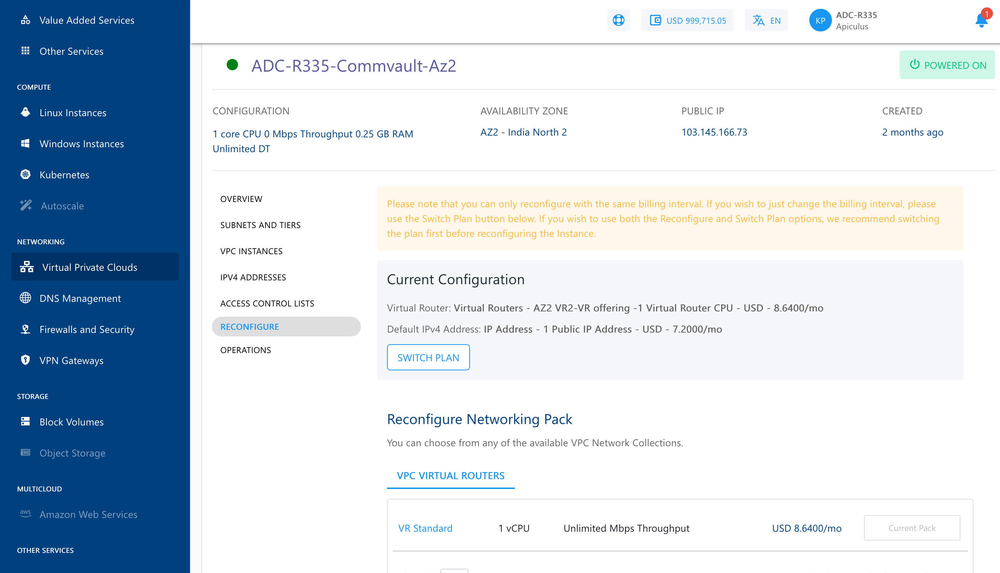

# Reconfiguring a VPC

The Reconfigure section/tab lists your current subscription details and allows you to reconfigure the networking pack or switch between **hourly** and **monthly** pricing.

:::note
You can only reconfigure with the same billing interval. To change the billing interval, use the Switch Plan button. We recommend switching the plan first before reconfiguring the instance if you wish to use both the Reconfigure and Switch Plan options. In either case, you will be charged based on the reconfiguration, not the existing plan.
:::

