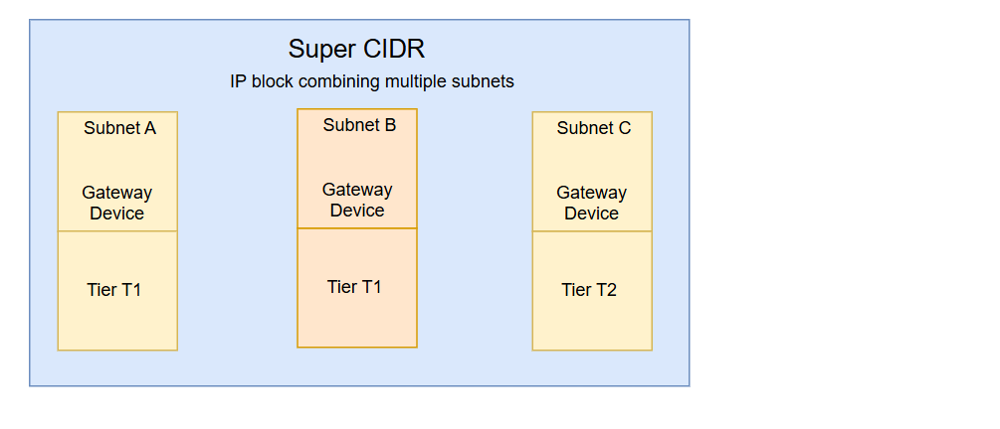
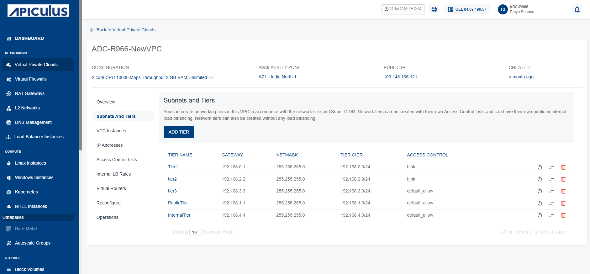
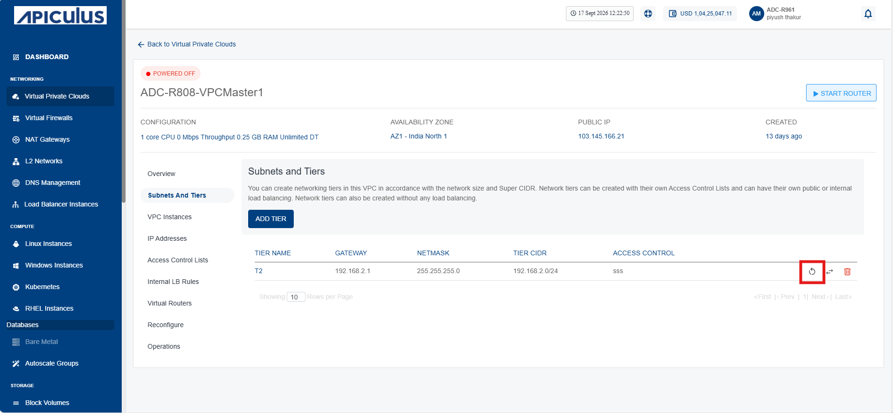
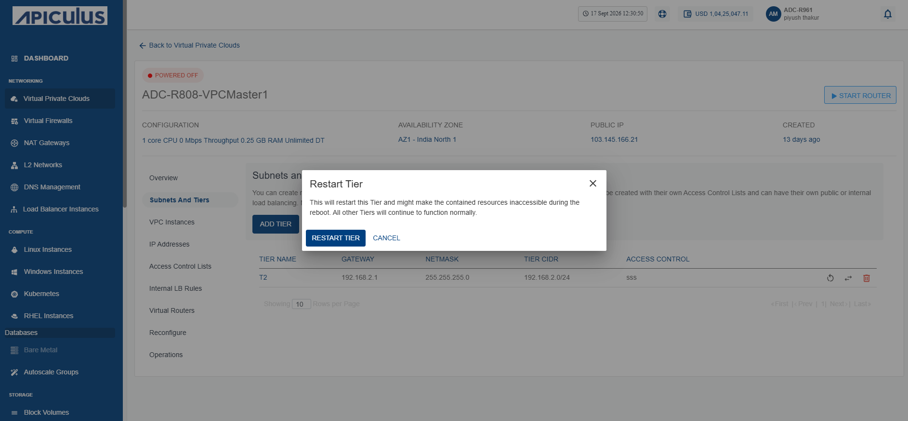
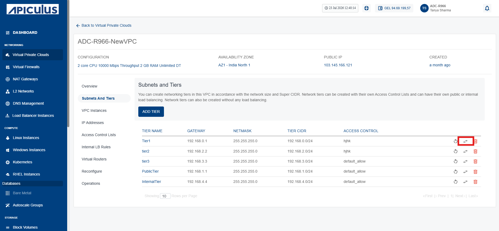
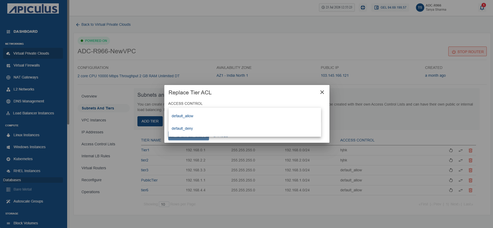
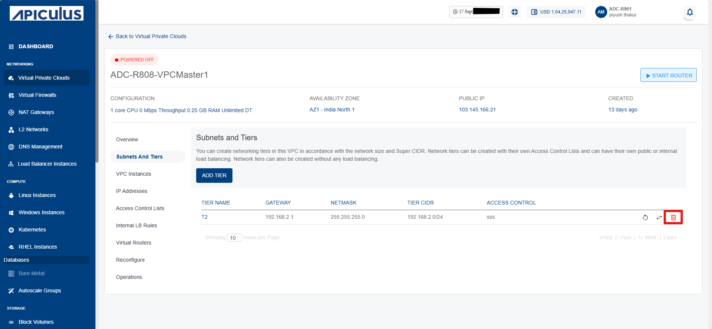
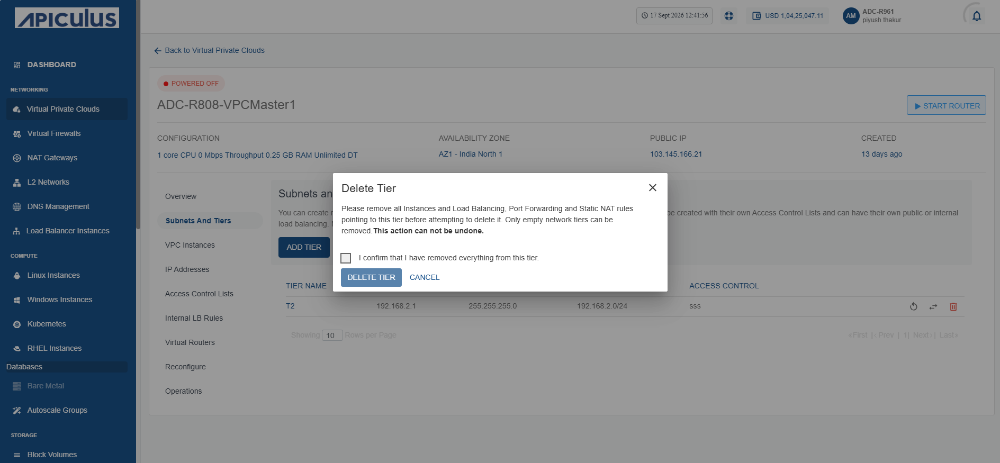

# Creating Subnets and Tiers
Subnets and tiers are essential components of network design to ensure efficient traffic
management and security.
 
In a VPC, subnets define IP-based network segments, and tiers represent logical layers of your application architecture. You can design networking tiers within this VPC based on the overall network size and the allocated Super CIDR range.

## Creating a Subnet and Tier

To create a subnet and tier, follow these steps:
1. Navigate to the **Networking** > **Virtual Private clouds** > **Subnets and Tiers** section. The following screen appears:

2. Click on your created VPC name from the list.
3. Click the **Add Tier** button. The following screen appears:

3. Enter the following details:
    - **Tier Name:** Name of the network tier you are creating.
    - **Gateway:** IP address for the gateway of the tier.
    - **Netmask:** Subnet mask defining the IP range.
    - **Access Control:** Choose rules for network traffic control.
4. Click the **Add Network Tier** button.
:::note 
You can attach the network tier to the instance as a Network Interface Card (NIC).
:::

## Restarting a Network Tier
To restart a network tier, follow these steps:

1. Navigate to the **Networking** > **Virtual Private clouds** > **Subnets and Tiers** section. The following screen appears:
	
2. Click on your created VPC name from the list.
3. Click the **Restart Network** (highlighted in red) icon.
	
	The following screen appears:
	
4. Click the **Restart Tier** button.
## Replacing an ACL
To replace an ACL, follow these steps:
1. Navigate to the **Networking** > **Virtual Private clouds** > **Subnets and Tiers** section. The following screen appears:
	
2. Click on your created VPC name from the list.
3. Click the **Replace Access Control List** (highlighted in red) icon.
	
	The following screen appears:
	
4. Select a different **ACL** from the dropdown list.
5. Click the **Replace Tier ACL** button.

The tier is attached with selected ACL.

## Deleting a Network Tier
To delete a network tier, follow these steps:
1. Navigate to the **Networking** > **Virtual Private clouds** > **Subnets and Tiers** section. The following screen appears:
	
2. Click on your created VPC name from the list.
3. Click the **Delete Network** (highlighted in red) icon.
	
The following screen appears:
	
4. Click **I confirm that I have removed everything from this tier** checkbox.
5. Click **Delete Tier** button.

:::note
You can delete only the empty tiers, which means that in order to delete a tier, ensure that there are no Instances and no NAT rule(s) associated with it.
:::

