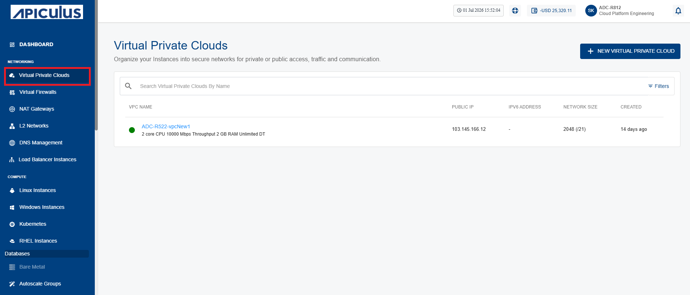
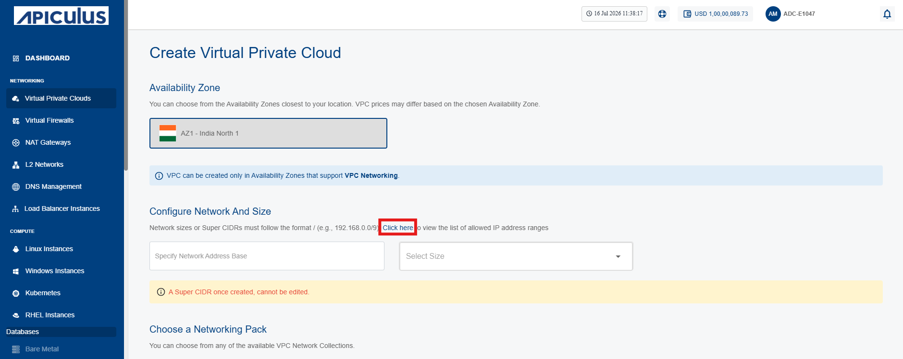
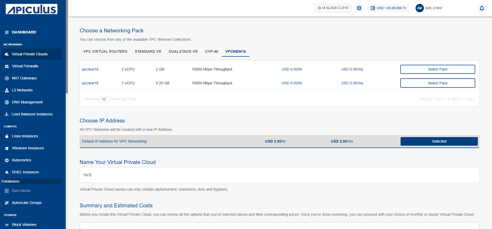
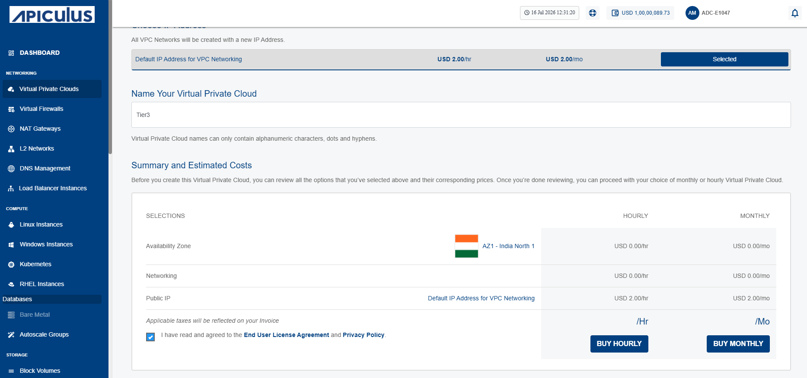

# Creating a VPC
A Virtual Private Cloud (VPC) is a private virtual network that provides a secure environment for your cloud resources. It helps you organize and manage your network while controlling communication between resources.

To create a VPC, follow the below steps:
1. Navigate to **Networking > Virtual Private Clouds**. The following screen appears:
	
2. Click the **New Virtual Private Cloud** button. The following screen appears: 
3. Choose an Availability Zone, which is the geographical region where your VPC will be configured.
4. Specify network address base size and select size i.e. The **super CIDR** for the internal IP allocation in an x.x.x.x/x format.
	:::note 
	To know allowed IP address ranges for VPC creation, select the **click here** link (highlighted in red).
	:::
	
	
5. Choose a **Dual Stack VPC (IPv6 + IPv4)** from the available networking pack.
	:::note 
	To configure IPv6 under a **VPC,** you must create a ticket with our support team for assistance. 
	:::
6. To create the VPC with a new NICNET IP address, select **Default IP Address for VPC Networking**.
7. Enter the valid name in the **Name your Virtual Private Cloud** field.
8. Verify the **Summary and Estimated Costs** section (Here, both the hourly and monthly price summaries are displayed).
9. Select the **I have read and agreed to the End User License Agreement and Privacy Policy** option.
10. To display the price summary, click the **Buy Hourly** or **Buy Monthly** button, a confirmation screen appears:
	
11. Click **Confirm**.

Once ready, you get the notification of this purchase on your email address on record.