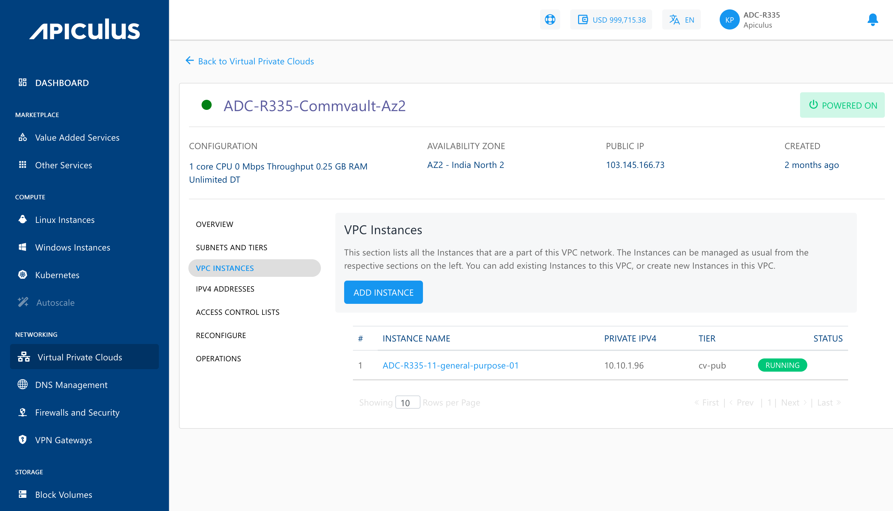
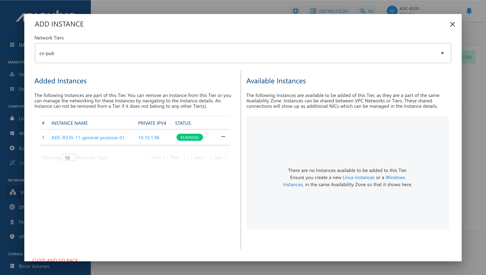
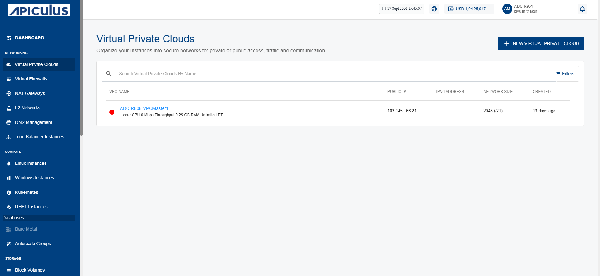
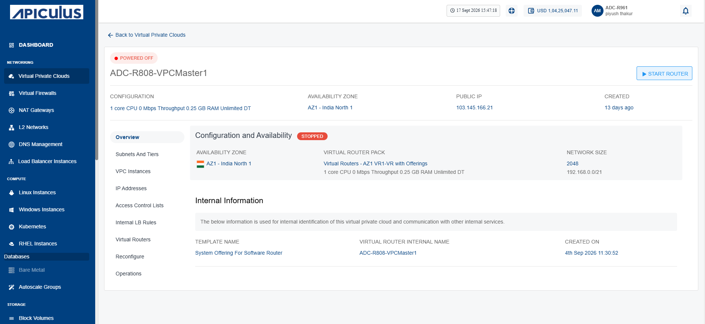
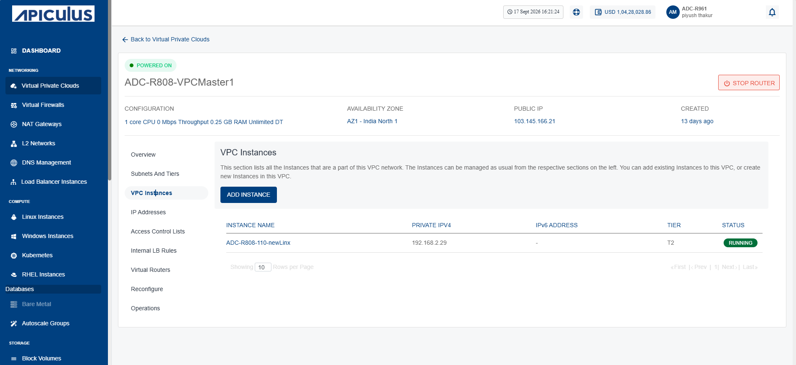

# Managing VPC Instances
VPC instances represent the instances running within your Virtual Private Cloud. This section helps you monitor their status and perform basic operations to keep your cloud resources running efficiently and reliably.

This section comprises of the following sub-sections:
- [Adding an Instances to VPC](#adding-an-instances-to-vpc)
- [Viewing Instances Associated to a VPC](#viewing-instances-associated-to-a-vpc)

## Adding an Instances to VPC

To add or remove instances to VPC, follow these steps:

1. To view all Instances that are available to add to this VPC, click **ADD INSTANCE** button.
2. Select the Network Tier where you want to add the available instances.

:::note
An Instance created in any VPC/advanced Availability Zone must be attached to at least one subnet.
:::

## Viewing Instances Associated to a VPC
Viewing instances associated with a VPC enables you to monitor the compute resources deployed within the selected network. The Apiculus Cloud portal provides a centralized view of all instances connected to a VPC, making it easier to review their deployment, verify network association, and efficiently manage resources within the VPC environment.

To view the instances that are a part of the VPC network, follow these steps:
1. Navigate to **Networking > Virtual Private Clouds**. The following screen appears:
	
2. Click on your created VPC name from the list. The following screen appears:
	
3. Click **VPC Instances**. The following screen appears:
	

