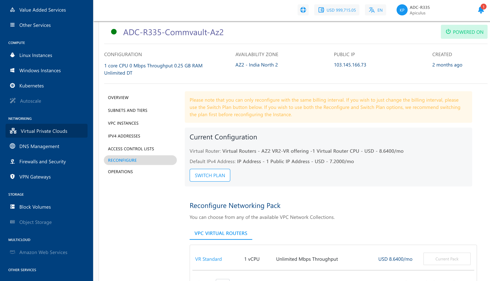

# VPC Management and Basic Operations

VPC management offers the following operations. These are basic VPC management actions and don't have any impact on the actual network configurations.

## Reconfiguring a VPC

The **Reconfigure** section/tab will list your current subscription details and allow you to reconfigure the networking pack, or switch between **hourly** and **monthly** pricing.

:::note
You can only reconfigure with the same billing interval. To change the billing interval, use the Switch Plan button. We recommend switching the plan first before reconfiguring the instance if you wish to use both the Reconfigure and Switch Plan options. In either case, you will be charged based on the reconfiguration, not the existing plan.
:::

## Powering ON/OFF the Virtual Router

Switching the VPC power state is possible using the **power status** button on top. This will usually be **green** if the VPC is powered ON, and grey if powered OFF.

To restart the VPC, navigate to the  **Operations** tab and click on the **RESTART VIRTUAL  ROUTER** option. This will perform a quick reboot and no data will be lost.

## Deleting a VPC

To delete a VPC, navigate to the Operations Section and click on the **DELETE VPC NETWORK** button. Deleting a VPC will remove it permanently.

:::note
Before attempting to delete this VPC, ensure that all Tiers, IPv4 Addresses, and Instances are removed from this VPC. This action is irreversible, and you may not be able to recover any data for this VPC.
:::
