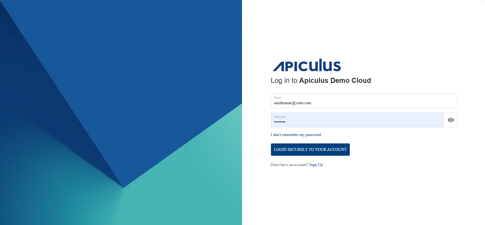

# Resetting Password
To reset your forgotten password, follow these steps:

1. You can reset your forgotten passwords clicking on **I don't remember my password**.
	
	The following screen appears:
2. Enter you email ID and verify via reCAPTCHA.
3. Click the **Send Password Reset Instructions** button.

If the email entered is valid and exists in the system, instructions to set a new password will be sent via email.

