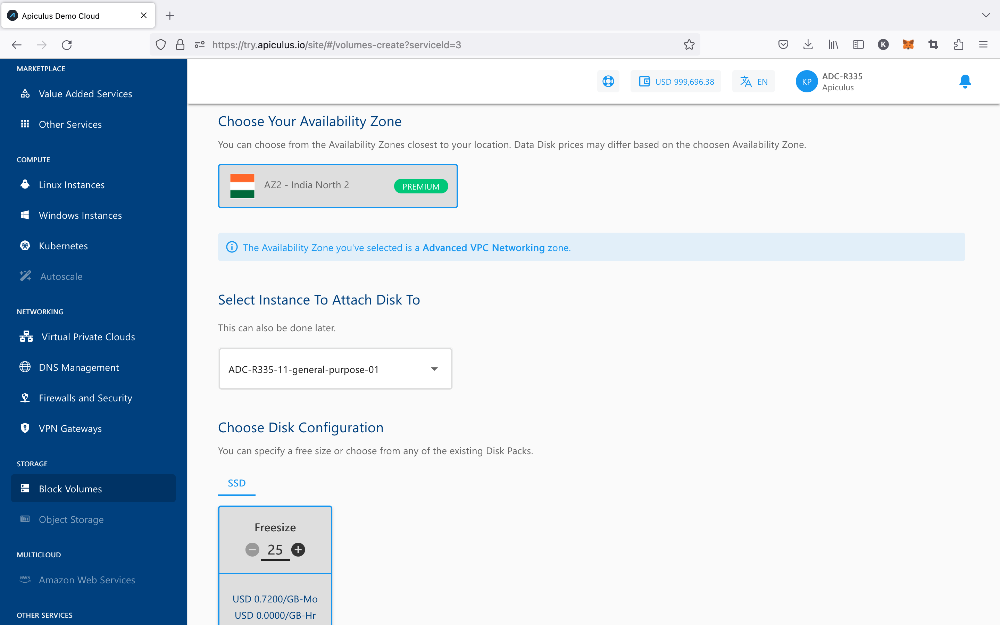
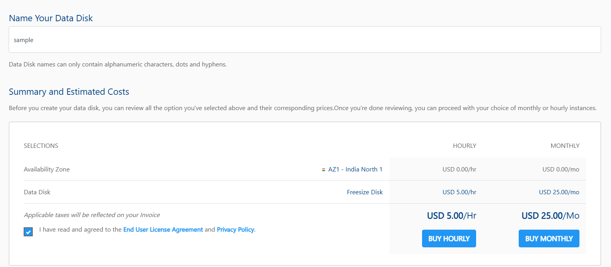
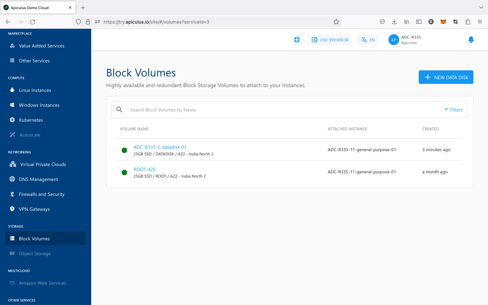

# Creating Data Disk
To create a Block Volume data disk, follow the below steps:

1. Navigate to **Storage > Block Volumes.**
2. Click on the **+ NEW DATA DISK** from the top right.
3. Enter the name for your Data Disk by following the naming convention mentioned below in the helper text.
4. Choose an Availability Zone.
5. Select an Instance from the list available in the dropdown to which you want to attach your Disk To. This is not mandatory; it can also be done later.
6. Choose the disk configuration from the available Disk packs, or you can use the free size option to specify the Disk configuration.
   
7. Verify the Estimated Cost of your Data Disk based on the options that you have chosen from the Summary and Estimated Costs Section( Here, both the Hourly and Monthly Prices summary will be displayed).
8. Click on the check box after going through the policies mentioned by your cloud service provider.
   
9. Clicking on the BUY HOURLY or BUY MONTHLY button, a confirmation pop-over will open up, and the price summary will be displayed along with the discount codes if you have any in your account. 
    1. You can apply any of the discount codes listed by clicking on the **APPLY** button. 
    2. You can also remove the applied discount code by clicking the **REMOVE** button. 
    3. Clicking on the **CANCEL** button, this action will be canceled.
10. Click on the **CONFIRM** to create the Data Disk.

:::note
This might take up to 5-8 minutes. You may use the Cloud Console during this time, but it is advised that you do not refresh the browser window.
:::

Once ready, you’ll be notified of this purchase on your email address on record. The newly created Data Disk can be accessed from **Storage >** **Block Volumes** on the main navigation panel.

