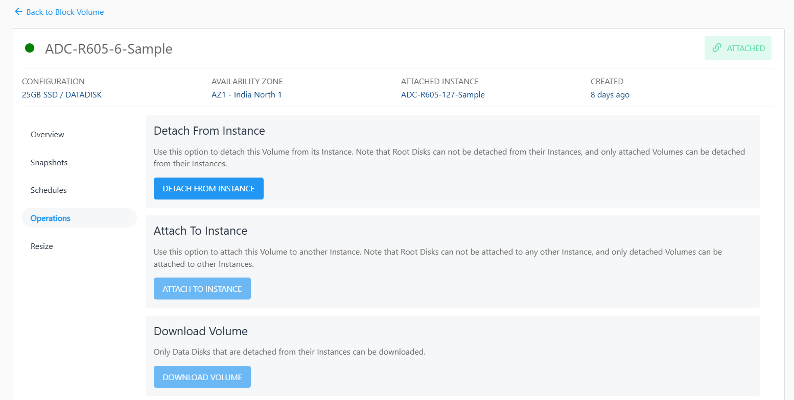
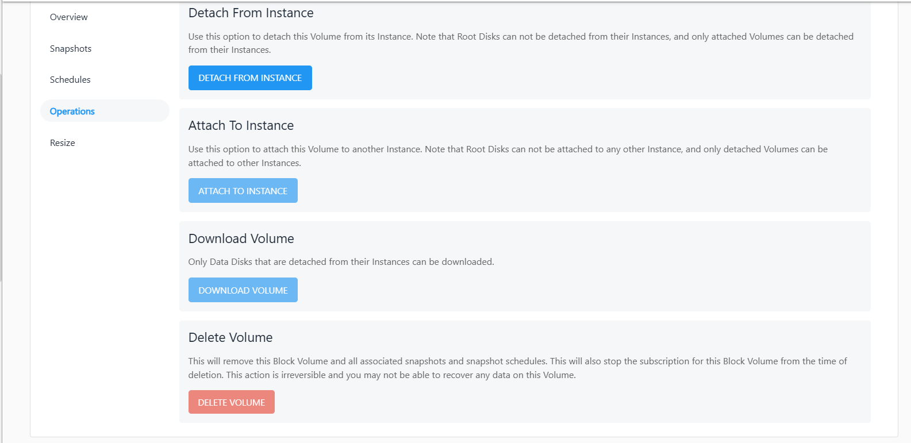

# Operations

To view all available Block Volume operations, navigate to the **Storage**, select the **Block Volumes** and access the **Operations** tab.

Apiculus Cloud Console provides the options to perform the following operations on Block Volumes:

- **Detach From Instance** -
	Use this option to detach this Volume from its Instance.
- **Attach To Instance** -
	Use this option to attach this Volume to another Instance.
	
	:::note
	Root Disks can not be detached from their Instances, and only attached Volumes can be detached from their Instances.
	:::
- **Download Volume** -
  Only Data Disks that are detached from their Instances can be downloaded.
- **Delete Volume** -
	This will remove the Block Volume and all associated snapshots and snapshot schedules. This will also stop the subscription for this Block Volume from the time of deletion.
	
	:::note
		This action is irreversible and you may not be able to recover any data on this Volume.
	:::	