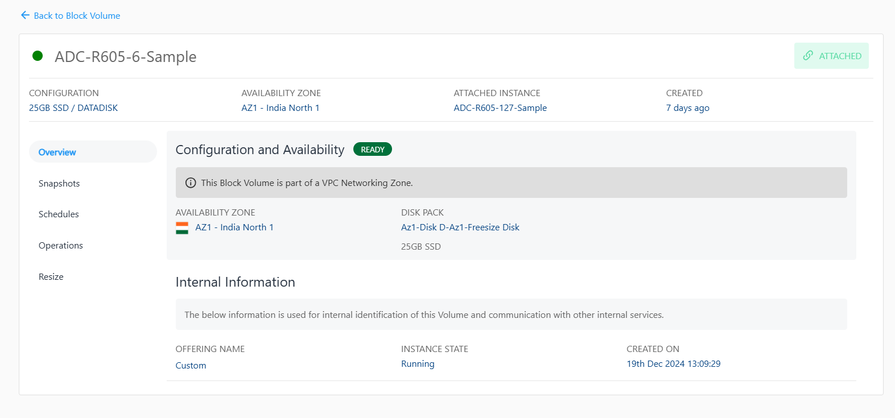

# Overview

Navigate to the **Overview** tab to view the following details:

- **Configuration and Availability** 
	This section displays the instance's status, **RUNNING**, is displayed in **green**, whereas STOPPED is displayed in greyed out and the information about the networking zone.
- **Internal Information** 
	This section displays the information used for internal identification of this instance and communication with other internal services.
	- Offering Name
	- Instance State
	- Created On
	

