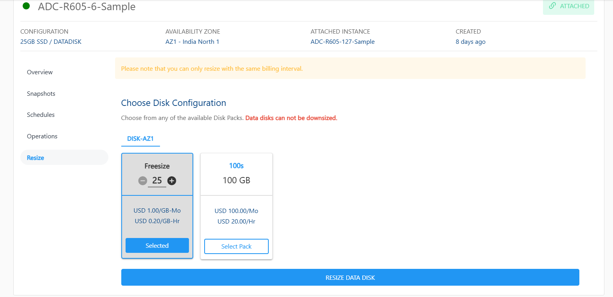
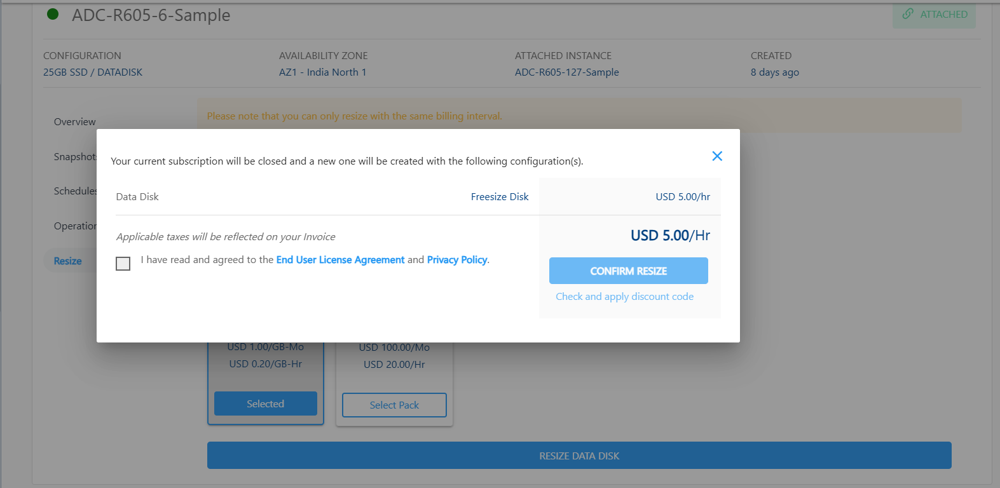

# Resize the Block Volume

To resize an available **Block Volumes**, navigate to **Storage**, select the **Block Volumes** and access the **Resize** tab.

Follow the steps to choose Disk Configuration on Apiculus Cloud Console:

- To resize the Data Disk, click the **RESIZE DATA DISK** button.  
	
- A dialog box will appear, closing the current subscription and creating a new one with your chosen configuration.  
- Check the checkbox and click the **CONFIRM RESIZE** button.
	
