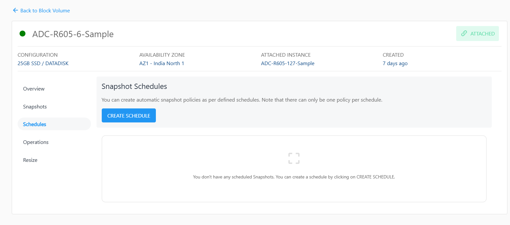
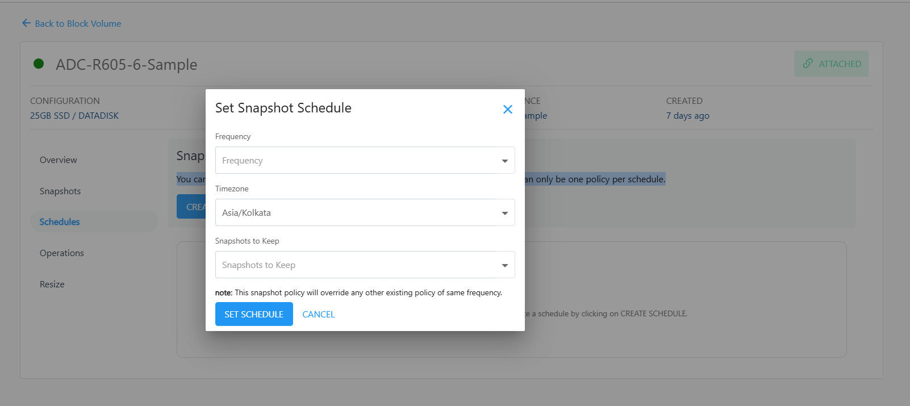

# Creating Automated Snapshot Schedules

Apiculus Cloud Console users can create snapshot policies for their root and data disks. These schedules allow for strategic management of data retention policies and can be used as an alternative backup solution. To create or manage the Snapshot schedules navigate to the **Schedules** section of disk details.

The following schedules are supported:

| Schedule | Description                                                                                       |
| -------- | ------------------------------------------------------------------------------------------------- |
| Hourly   | Snapshot will be taken every specified minutes past the hour                                      |
| Daily    | Snapshot will be taken every day at the specified time of day                                     |
| Weekly   | Snapshot will be taken every week on the specified day of week and at the specified time of day   |
| Monthly  | Snapshot will be taken every month on the specified day of month and at the specified time of day |

You can create automatic snapshot policies as per defined schedules. 

## Set Snapshot Schedule

While configuring snapshot schedules, the following points should be considered:

- There can only be one policy per schedule, and creating a second policy of an existing schedule will override the previous one.
- All schedule options support time specifications in custom time zones.
- All schedule options allow for a **snapshots to keep** option, which is a limit on how many snapshots to keep (or rotate after) as the retention policy.
  
To create the Snapshot Schedule, click on create Schedule and the following dilog box appears.

Select the below details in the form to set the Snapshot Schedule.
- Frequency
- TimeZone
- Snapshots to Keep
:::note
	There can only be one policy per schedule; the new snapshot policy overrides the existing policy of the same frequency.
:::