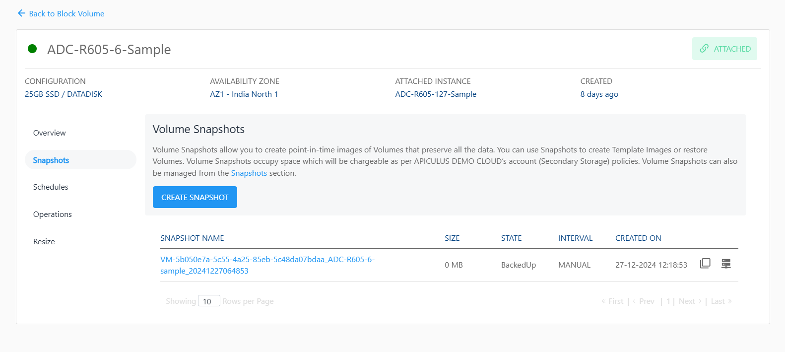

# Working with Volume Snapshots

**Apiculus Block Volumes** service provides extensive functionality for managing volume snapshots. Snapshots are point-in-time 'images' of a volume’s contents and can be used as a restoration point for the parent volume. The following sections outline all available snapshot functions and capabilities in the Apiculus Cloud Console.

## Creating Instant Snapshots

Volume snapshots can be created manually with the current timestamp by clicking the **CREATE SNAPSHOT** button under the **Snapshots** tab/section of any disk. This will generate a snapshot that can be used to create an **Image (template)** or restore an existing volume.

## Creating a Volume from a Snapshot

Volume Snapshots created manually or using a schedule lists under the **Snapshots** section of disk details. To create a new data disk using a snapshot, the option to **create volume** can be used, which will initiate a purchase flow similar to [creating a data disk](/docs/Subscribers/Storage/BlockVolumes/CreatingDataDisk).

:::note
This operation may have associated billing impacts.
:::

## Creating an Image from a Snapshot

Volume Snapshots can be used to create OS Images which can be used at the time of Instance creation. This can be done by using the option to **create image** which makes the template available and listed under the **My Images** section.

:::note
Images occupy account-level storage space which may be billed on usage by the service provider.
:::

