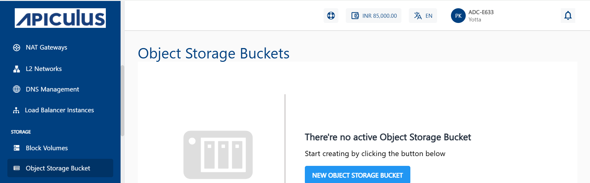
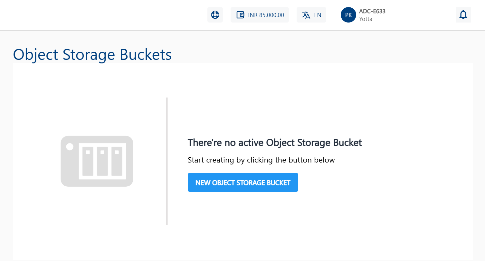
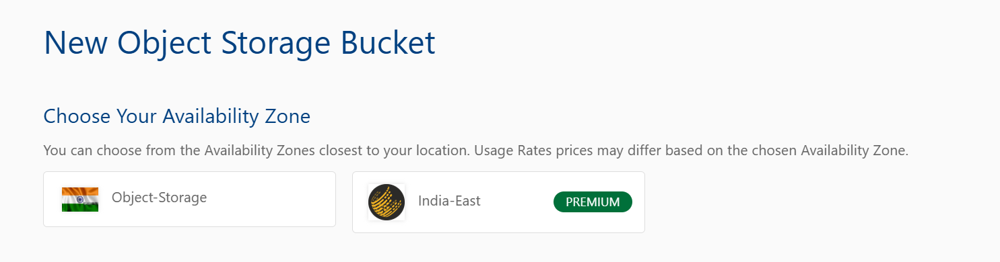
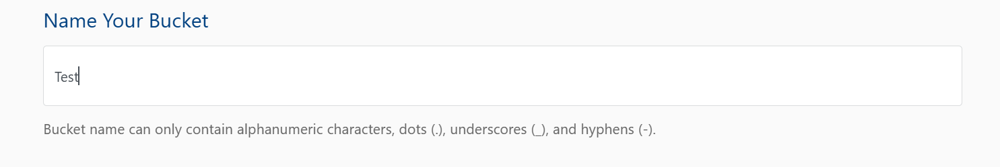
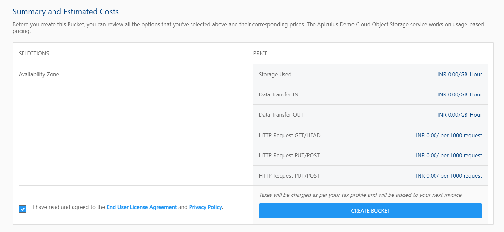

# Creating Object Storage Bucket

An Object Storage Bucket is where you store your files in the cloud. Creating an Object Storage Bucket is the first step to organize, access, and manage your data easily.

To create an Object Storage Bucket, follow these steps:

1. Navigate to **Storage > Object Storage Bucket** from the left-hand menu.

	

2. Click the **New Object Storage Bucket** button.

	

3. Choose Your Availability Zone from the listed options.

	

	:::note 
	Pricing may vary based on the selected availability zone.
	:::

4. In the **Name Your Bucket** field, enter a valid bucket name.

	

	:::note 
	Bucket names may include alphanumeric characters, dots (.), underscores (_), and hyphens (-).
	:::

5. Review the **Summary and Estimated Costs** section.

	

   This section outlines usage-based pricing details for:
	- Storage Used
	- Data Transfer IN
	- Data Transfer OUT
	- HTTP Request GET/HEAD
	- HTTP Request PUT/POST

	Scroll down and select the **End User License Agreement** and **Privacy Policy** checkbox.

	

6. Click the **Create Bucket** button to finalize the setup.

