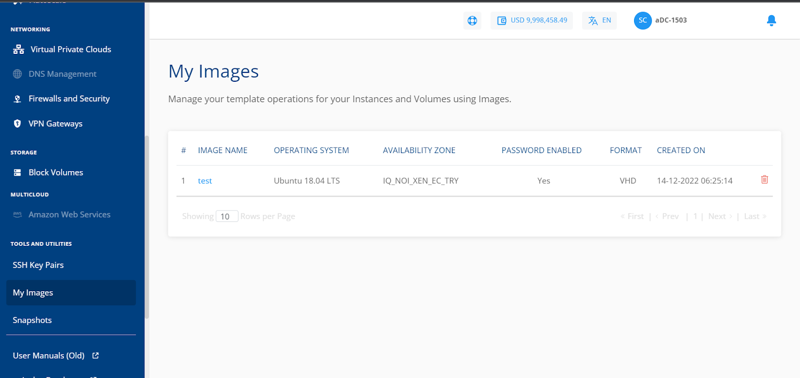
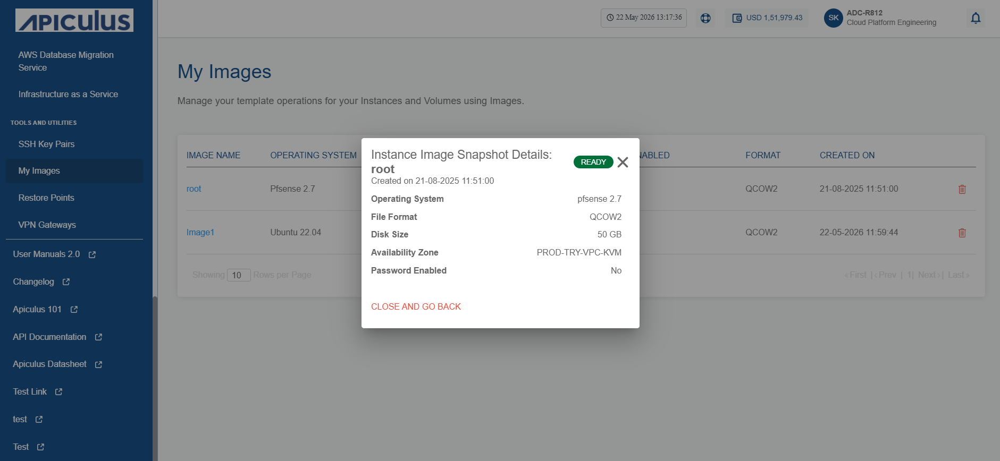
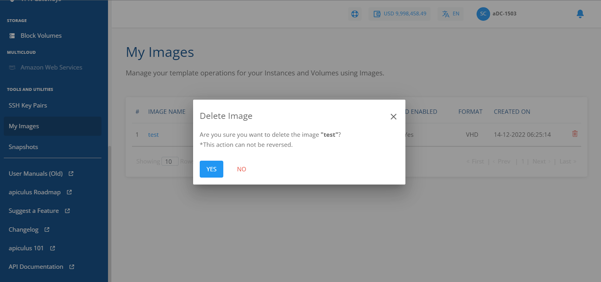

# Managing Custom Images
Custom OS templates can be created from a [Volume Snapshot](/docs/Subscribers/Storage/BlockVolumes/DetailsofBlockVolumes/WorkingwithVolumeSnapshots#creating-a-volume-from-a-snapshot). 

## Viewing Custom Image
To view custom images, perform these steps:
1. Navigate to **Tools and Utilities > My Images**. The following screen appears:
2. Click on the image name. The following screen appears that shows the details associated with the image:
## Deleting a Custom Image
You can delete an image by clicking the delete icon. You can also check the status by clicking the image name.

You can use these Images while creating new Linux or Windows Instances. 

