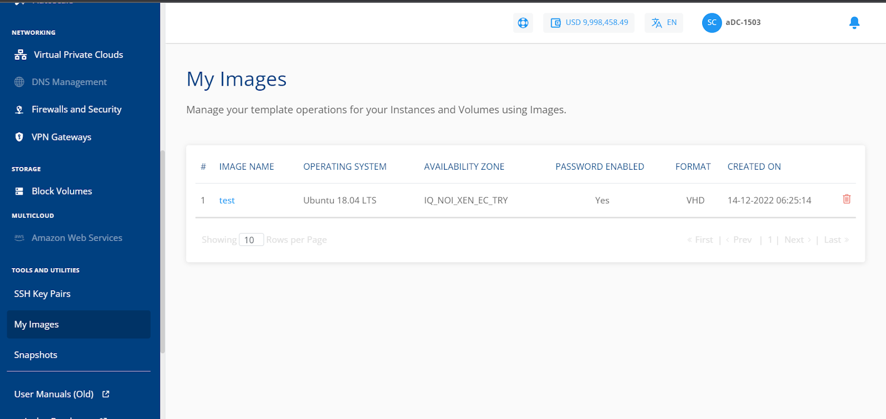
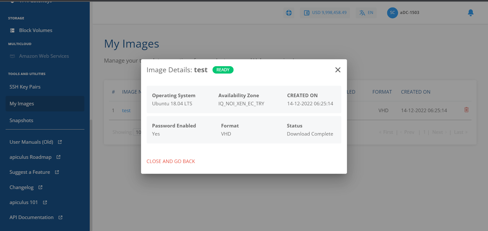

# Managing Custom Templates and Images

Custom OS templates can be created from a Volume Snapshot. To view custom templates, navigate to **Tools and Utilities > My Images**. The following details are displayed:

- Image Name
- Operating System
- Availability Zone
- Password Enabled
- Format
- Created On

You can delete an image by clicking the delete icon. You can also check the status by clicking the image name.

These Images can be used while creating new Linux or Windows Instances.  To view the images navigate to the **Tools and Utilities** section and select the **MY IMAGES** tab.

