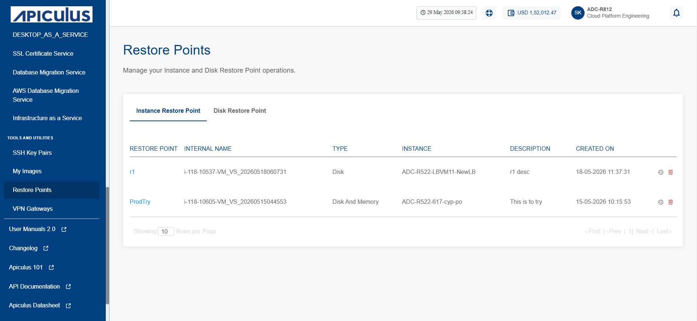
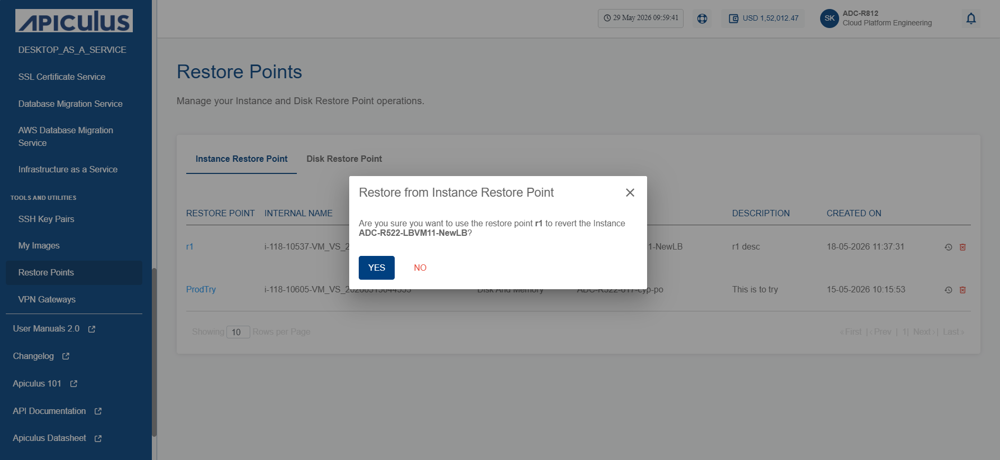
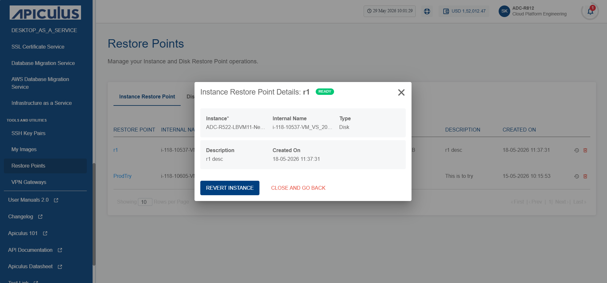
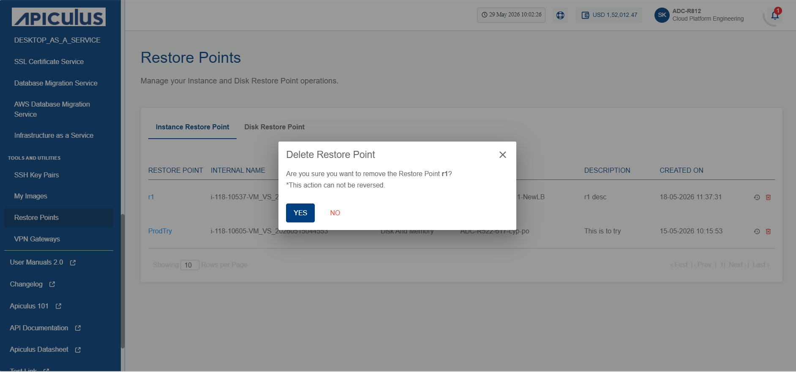
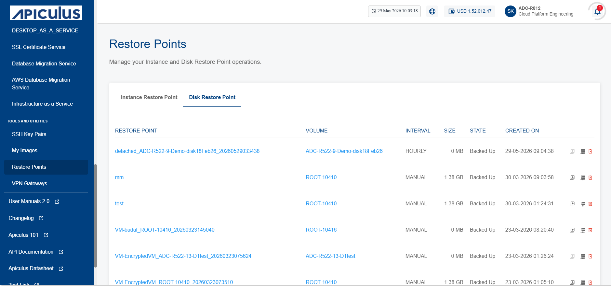
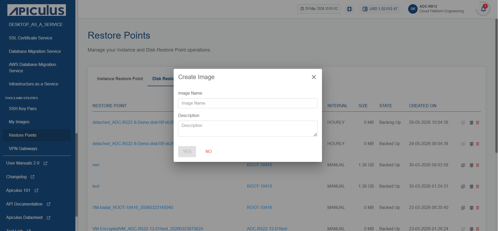
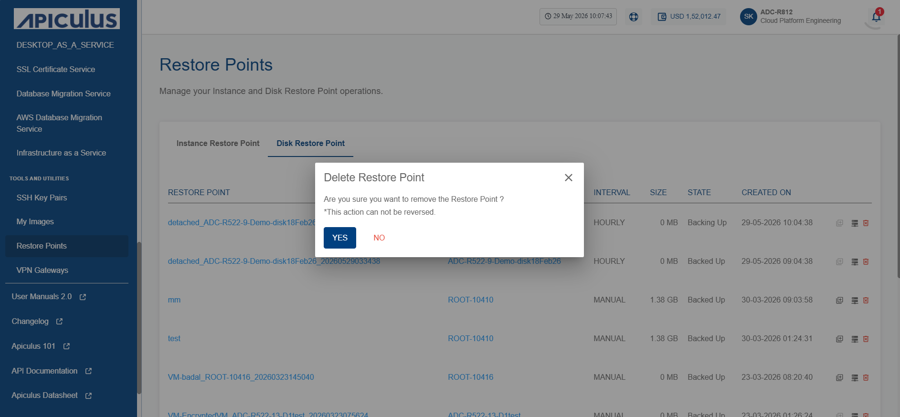

# Managing Restore Points

Snapshots use the [Apiculus Block Volumes](/docs/Subscribers/Storage/BlockVolumes/AboutBlockVolumes) service and occupy billable storage space.

You can view and manage all your instance and Volume Snapshots and perform various associated operations.
## Instance Restore Point

The instance snapshots tab lists the following details:

-  Name
- Description
- Internal Name
- Instance
- Type
- Created On

To revert the Instance to the snapshot point, click the icon present in the right corner before the delete icon, or also you can click on the snapshot name and then click the **REVERT INSTANCE** button.

To delete the Instance Snapshot, click the **delete** icon from the right corner.

## Disk Restore Point

The volume snapshots section shows the following details:

- Name
- Volume Name
- Size
- State
- Interval
- Created on

To revert the image from the volume snapshot, click on the icon present at the right corner before the delete icon, or click the snapshot name and then click **SAVE AS IMAGE**.

To delete the Volume Snapshot, click the **delete** icon from the right corner.

