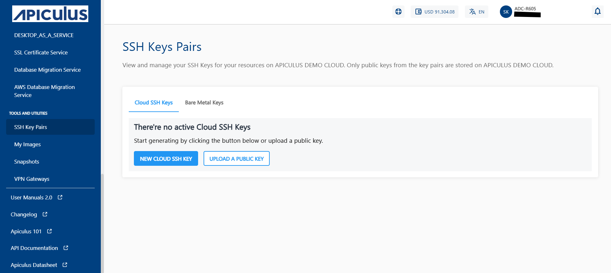
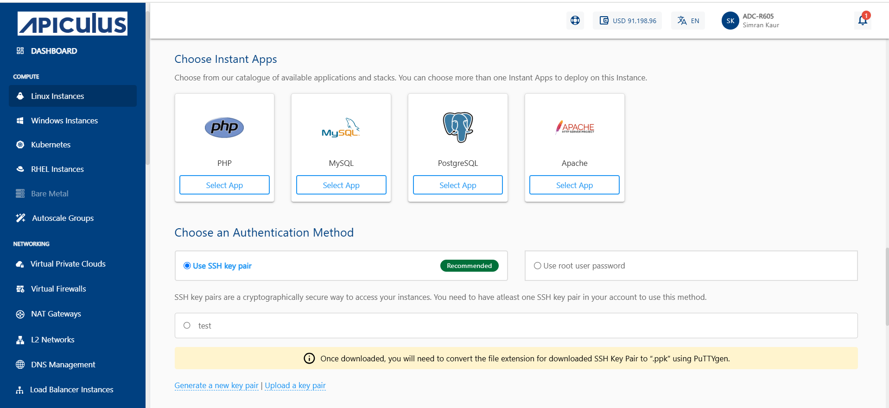
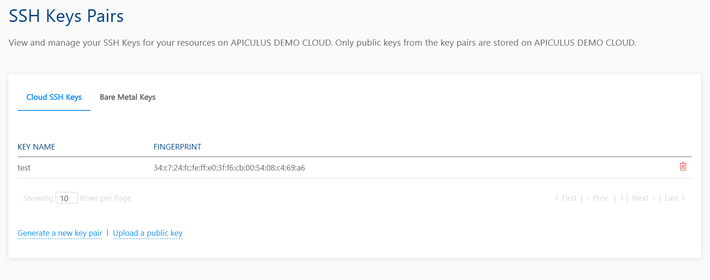

# Managing SSH Keys and Key Pairs for Linux Instances

The Apiculus Cloud Console allows you to create secure shell connections to Instances in your account by using SSH keys, in addition to using Instance passwords. Since passwords can be easily compromised, SSH keys provide a more secure alternative. These keys function as encrypted signatures and work only when their public and private components match.
## Managing SSH Keys

SSH keys can be managed from the **Tools and Utilities > SSH Key Pairs** section in the main navigation panel. 
You can create SSH keys by two methods:
- New Cloud SSH KEY
- UPLOAD A PUBLIC KEY

## New Cloud SSH Key

To generate new SSH key pairs, click the **Generate a new key pair** button.
	
:::note
This creates a public-private key pair, downloading the private key to your system while storing the public key in your Apiculus Cloud Console account. You can then use the downloaded private key to connect to virtual machines associated with the corresponding public key.
:::
## Upload Public Key

To Upload existing public keys from your system, click the **UPLOAD PUBLIC KEY** button. 
	
:::note
This requires you to already have a key pair on your system, and you simply need to upload the contents of the public key (usually a .pub file from your system’s SSH directory) to your Apiculus Cloud Console account.
:::
## Using Linux Instances with SSH Keys

To use an Linux Instance with an SSH key, it needs to be associated with a key first. This can be done in two ways:

1. While [creating a new Linux Instance](/docs/Subscribers/Compute/LinuxInstances/CreatingLinuxInstances), in the provisioning details form, choose any of the SSH options from the **Use SSH key pair** option under **Choose an Authentication method**. This will let you:
    1. Generate a new key pair.
    2. Upload a public key from your system.
    3. Select an existing SSH key from your Apiculus Cloud Console account.
    
2. For existing Instances, you can set or reset SSH key associations by navigating to the **Instances  Operations** section and using the **Reset SSH Key** option. To use this option, the instance needs to be stopped first. This option lets you choose an SSH key already added to your Apiculus Cloud account.

Once a SSH key pair has been associated with a Linux Instance, the [Instance can be accessed via a SSH connection](/docs/Subscribers/Compute/LinuxInstances/ConnectingtoaLinuxInstance), authenticated with the private key on your local machine.

## Deleting a SSH Public key

If a SSH public key is deleted from the Apiculus Cloud Console account, you'll no longer be able to connect to the Linux Instance(s) associated with the key pair, however you can use a password to connect to the Instance.

To re-associate a key pair, you might need to open the **known_hosts** or **hosts** file on your local machine and delete all rows/entries related to the Instance(s) using the SSH key pair.

